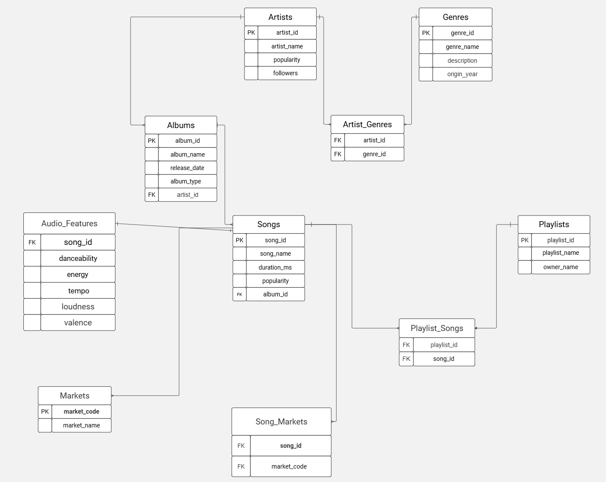

# SpotTracks Database

## Overview

SpotTracks Database is a PostgreSQL project that demonstrates the design and implementation of a relational database for a Spotify-inspired music streaming platform.

The project covers the complete database development process, including schema design, data population, data enrichment, and analytical SQL queries.

---

## Technologies

- PostgreSQL
- SQL
- Spotify API
- Relational Database Design
- Database Normalization

---

## Database Structure

The database consists of the following entities:

- Artists
- Genres
- Albums
- Songs
- Audio Features
- Markets
- Playlists

Many-to-many relationships are implemented through junction tables:

- artist_genres
- song_markets
- playlists_songs

---

## Database Schema

The database schema is shown below.



---

## Project Structure

```
spottracks-database/
│
├── README.md
├── schema.sql
├── spotify_full_inserts.sql
├── data_updates.sql
├── analytical_queries.sql
└── database_diagram.jpg
```

---

## Files Description

### schema.sql

Creates the complete database schema, including:

- tables
- primary keys
- foreign keys
- constraints

---

### spotify_full_inserts.sql

Populates the database with Spotify data.

---

### data_updates.sql

Adds additional information and enriches the dataset by:

- generating audio features
- assigning album types
- adding genre descriptions
- adding genre origin years

---

### analytical_queries.sql

Contains SQL queries demonstrating:

- filtering
- sorting
- JOIN operations
- aggregation
- subqueries
- set operations

---

## Skills Demonstrated

- Relational database design
- Database normalization
- SQL data definition (DDL)
- SQL data manipulation (DML)
- JOIN operations
- Aggregate functions
- Subqueries
- Set operations
- Data modeling
- Constraint design

---

## Project Purpose

The purpose of this project is to demonstrate practical SQL skills and database design techniques using a realistic music streaming database based on Spotify API data.
